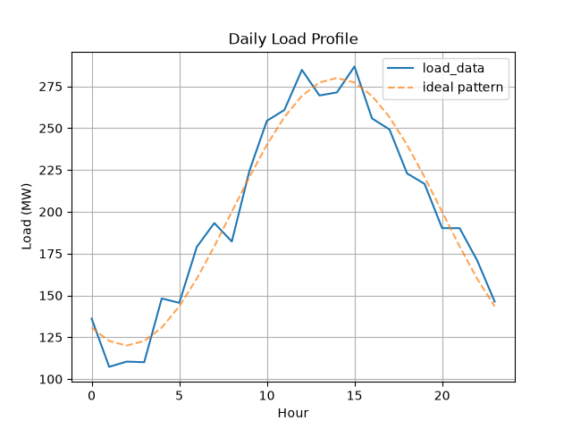
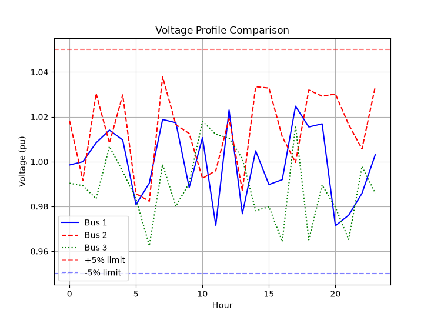
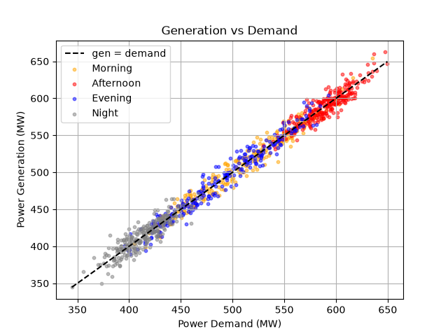
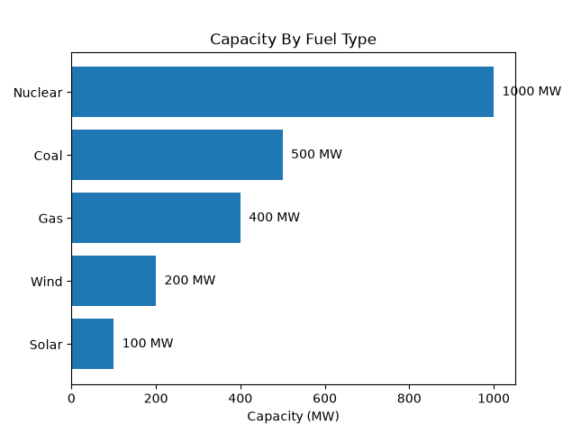
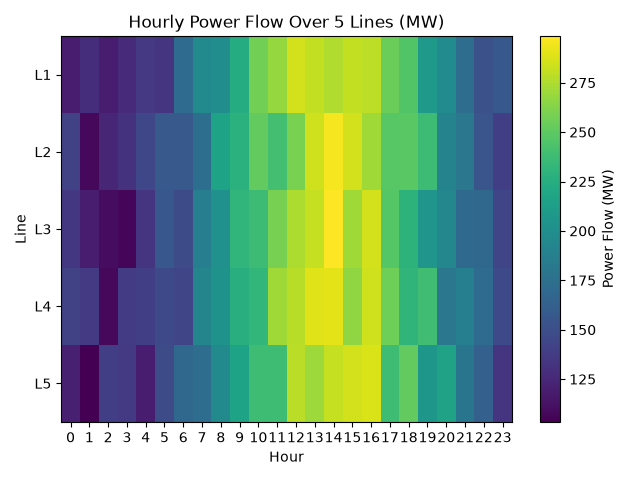
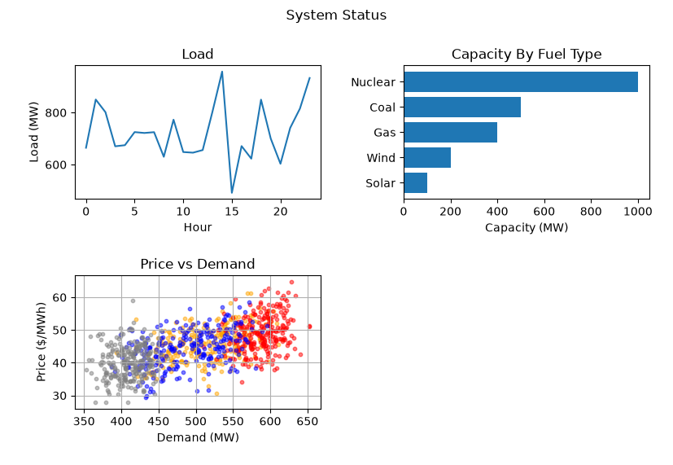

# Python Homework Exercises

> **Instructions**: Complete the exercises below. For each exercise, write your solution in a Python script or Jupyter notebook cell. When you are ready, share your code and I will review it.
>
> **Note**: These exercises assume you are proficient in Python but may be rusty on electrical engineering concepts. Each section includes brief explanations to help you relearn the domain as you go.

---

## Introduction: Power Systems Basics

**Per-Unit System**: Power engineers normalize values to a common base to simplify calculations. For example, 105 MVA on a 100 MVA base is 1.05 per-unit (pu).

**AC Power**: Unlike DC, AC power has both real (P, measured in MW) and reactive (Q, measured in MVAr) components. Apparent power (S, measured in MVA) is the vector sum: S = P + jQ.

**Voltage Phasor**: An AC voltage is described by magnitude (|V|) and angle (δ). In complex form: V = |V|∠δ = |V|e^(jδ).

**Admittance (Y)**: The reciprocal of impedance (Z). Y = G + jB, where G is conductance and B is susceptance. In power systems, lines are mostly inductive, so B is negative.

**Load Flow Analysis**: The process of calculating steady-state voltages and power flows in a power system. It solves the nonlinear equation: Y_bus × V = I.

---

## 1. NumPy

### Exercise 1.1: Voltage Magnitude Array
Create a 1D NumPy array representing voltage magnitudes (in per-unit) at 5 buses: `[1.02, 0.98, 1.00, 1.03, 0.99]`. Print the array, its shape, and its data type.

*Note: In power systems, "per-unit" means normalized to a base value (e.g., 100 kV). A value of 1.0 means the voltage is exactly at the nominal level.*

**Your Answer**:
```python
import numpy as np

a = np.array([1.02, 0.98, 1.00, 1.03, 0.99])

print("a         : ", a)
print("Shape     : ", a.shape)
print("Array type: ", a.dtype)

# Output:
# a         :  [1.02 0.98 1.   1.03 0.99]
# Shape     :  (5,)
# Array type:  float64
```

---

### Exercise 1.2: Building a Simple Matrix
Create a 3x3 matrix representing a simplified Y-bus (admittance matrix) where:
- Diagonal elements are 10 (representing self-admittance)
- Off-diagonal elements are -2 (representing mutual admittance between connected buses)

Print the matrix and verify it is symmetric.

*Note: Y-bus is the fundamental matrix used in power system analysis. Each row/column represents a bus, and the values describe how electricity can flow between buses.*

**Your Answer**:
```python
import numpy as np

ybus = np.array([
                    [10, -2, -2],
                    [-2, 10, -2],
                    [-2, -2, 10]
                ])

print("ybus:\n", ybus)

is_symmetric = np.array_equal(ybus, ybus.T)
print(f"ybus is symmetrical: {is_symmetric}")

# Output:
# ybus:
#  [[10 -2 -2]
#  [-2 10 -2]
#  [-2 -2 10]]
# ybus is symmetrical: True
```

---

### Exercise 1.3: Power Calculation
Given two arrays `V = [1.0, 1.02, 0.98]` and `angle = [0, 0.1, -0.05]` (in radians), compute the complex voltage phasors `V_complex = V * exp(j * angle)`. Then compute the complex power injected at each bus if the current injection is `I = [1+0.5j, 0.8-0.2j, 1.2+0.3j]`.

*Hint: Complex power S = V × I* (where I* is the complex conjugate of current). Use `numpy.conj()`.

*Note: This is the fundamental power equation. The real part of S is active power (MW), the imaginary part is reactive power (MVAr).*

**Your Answer**:
```python
import numpy as np

np.set_printoptions(formatter={"float_kind": "{:.4f}".format})

V = np.array([1.0, 1.02, 0.98])  # voltage
angle = np.array([0, 0.1, -0.05])  # radians
I = np.array([1 + 0.5j, 0.8 - 0.2j, 1.2 + 0.3j])  # current

I_conj = np.conjugate(I)

V_complex = V * np.exp(1j * angle)

S_complex = V_complex * I_conj

print("V          : ", V)
print("V_complex  : ", V_complex)
print("I          : ", I)
print("I conjugate: ", I_conj)
print("S_complex  : ")
for complex_power in S_complex:
    print(f"\tP: {complex_power.real:6.3f} \tQ: {complex_power.imag:6.3f}")

# Output:
# V          :  [1.0000 1.0200 0.9800]
# V_complex  :  [1.        +0.j         1.01490425+0.10183008j 0.97877526-0.04897959j]
# I          :  [1. +0.5j 0.8-0.2j 1.2+0.3j]
# I conjugate:  [1. -0.5j 0.8+0.2j 1.2-0.3j]
# S_complex  :
#         P:  1.000       Q: -0.500
#         P:  0.792       Q:  0.284
#         P:  1.160       Q: -0.352
```

---

### Exercise 1.4: Per-Unit Conversion
You have a 2D array of power values in MW for 3 generators over 24 hours (shape: 3x24). Convert all values to per-unit using a base of 100 MVA. Use broadcasting to avoid loops.

*Note: Per-unit values make it easier to compare systems of different sizes. P_pu = P_MW / S_base.*

**Your Answer**:
```python
import numpy as np

# Generator sizes by type:
# - Base load (e.g., coal/nuclear): 100–300 MW (1.0–3.0 pu)
# - Mid-merit (e.g., combined cycle gas): 50–150 MW (0.5–1.5 pu)
# - Peaker (e.g., gas turbine): 20–80 MW (0.2–0.8 pu)

# Three generators, 24 hours each
gen1 = np.random.uniform(100, 300, 24)  # base load
gen2 = np.random.uniform(50, 150, 24)  # mid-merit
gen3 = np.random.uniform(20, 80, 24)  # peaker

P_mw = np.array([gen1, gen2, gen3])
base_power = 100.0  # MVA
P_mw_broadcast = P_mw / base_power

print("P_mw.shape:")
print(P_mw.shape)
print("P_mw:")
print(P_mw)
print("P_mw_broadcast:")
print(P_mw_broadcast)

# Output:
# P_mw.shape:
# (3, 24)
# P_mw:
# [[167.84917751 280.20353139 267.73667059 186.64391958 153.7022188
#   289.47781724 290.96574036 178.38490336 202.19967661 291.15311026
#   128.9624342  246.80319646 173.24743351 221.30893199 116.7254522
#   255.05123959 218.16659862 159.12628164 142.57995533 129.27964204
#   156.33699528 143.17831714 158.44094723 251.59558405]
#  [ 75.56905144  96.615374    61.48008959  62.05722717 126.07732877
#   149.61017672  98.22813346  97.80271333 135.90094259  58.67240927
#    51.40638345 138.32276667 110.56863237 139.41480959 118.80738337
#    62.03164749  70.65609478  69.81230448 135.18979667 110.09294692
#   148.21445533  54.71551898  81.63318452  77.74011897]
#  [ 69.33145843  64.02814783  48.48566274  49.68181071  48.30515822
#    47.96201207  24.14433988  57.91883408  75.81947373  26.42210384
#    67.04489556  27.60714879  75.72338778  22.87106616  27.56652515
#    49.64969311  68.3060724   38.37879569  56.92631364  40.85080287
#    35.57955598  49.16792295  60.06985277  40.71269285]]
# P_mw_broadcast:
# [[1.67849178 2.80203531 2.67736671 1.8664392  1.53702219 2.89477817
#   2.9096574  1.78384903 2.02199677 2.9115311  1.28962434 2.46803196
#   1.73247434 2.21308932 1.16725452 2.5505124  2.18166599 1.59126282
#   1.42579955 1.29279642 1.56336995 1.43178317 1.58440947 2.51595584]
#  [0.75569051 0.96615374 0.6148009  0.62057227 1.26077329 1.49610177
#   0.98228133 0.97802713 1.35900943 0.58672409 0.51406383 1.38322767
#   1.10568632 1.3941481  1.18807383 0.62031647 0.70656095 0.69812304
#   1.35189797 1.10092947 1.48214455 0.54715519 0.81633185 0.77740119]
#  [0.69331458 0.64028148 0.48485663 0.49681811 0.48305158 0.47962012
#   0.2414434  0.57918834 0.75819474 0.26422104 0.67044896 0.27607149
#   0.75723388 0.22871066 0.27566525 0.49649693 0.68306072 0.38378796
#   0.56926314 0.40850803 0.35579556 0.49167923 0.60069853 0.40712693]]

```

---

### Exercise 1.5: Simple DC Load Flow
In a simplified DC load flow, we ignore reactive power and voltage angles. Solve the linear system `B × θ = P` for bus angles θ, where `B` is a 3x3 susceptance matrix and `P` is the vector of real power injections.

*Note: This is the linear approximation used in market analysis and contingency screening. The solution gives voltage angles, which determine power flows.*

Use `numpy.linalg.solve`.

**Your Answer**:
```python
import numpy as np

# The B matrix (susceptance):
#   - A simplified version of the Y-bus from Exercise 1.2
#   - Diagonal = sum of line susceptances connected to that bus
#   - Off-diagonal = negative of the line susceptance between those buses
#
# For a 3-bus system with lines 1-2, 2-3, and 1-3:

B = np.array([[15, -10, -5], [-10, 20, -10], [-5, -10, 15]])

# The P vector (power injections):
#   - Positive = generation supplying power
#   - Negative = load consuming power
#   - Sum of all P must equal zero (conservation of energy)
#
# Bus 1 generates 100 MW, Buses 2&3 each consume 50 MW:

P = np.array([1.0, -0.5, -0.5])

# Solve for the bus angles θ in B × θ = P

θ = np.linalg.solve(B, P)

print("Solve for the bus angles θ in B x θ = P.\n")
print("B (susceptance):")
print(B)
print("\nP (real power injections):")
print(P)
print("\nBus Angles:")
print(θ)
print("\nVerification (B @ θ):")
print(B @ θ)

# Output:
# Solve for the bus angles θ in B x θ = P.

# B (susceptance):
# [[ 15 -10  -5]
#  [-10  20 -10]
#  [ -5 -10  15]]

# P (real power injections):
# [ 1.  -0.5 -0.5]

# Bus Angles:
# [ 0.04375 -0.01875 -0.03125]

# Verification (B @ θ):
# [ 1.  -0.5 -0.5]
```

---

### Exercise 1.6: Overloaded Line Detection
Given a 1D array of line flows (in MVA) and a 1D array of corresponding line ratings, find the indices of all lines that are operating above 90% of their rating. Return both the indices and the actual overload percentages.

*Note: Transmission lines have thermal limits. Operating above rating can cause the line to sag and potentially touch trees/ground.*

**Your Answer**:
```python
import numpy as np

# Line Flow Ranges
#        System Type         Typical Line Flow (MVA)  Typical Line Rating
# -----------------------------------------------------------------------
# Distribution Feeders	     1 – 10 MVA               5 - 30 MVA
# Major Transmission Lines	 100 – 1,000 MVA          100 - 1200 MVA

line_flows_mva = np.array([120, 180, 250, 480, 400, 500, 650, 1000, 1000, 1400])
line_ratings_mva = np.array([200, 300, 400, 500, 600, 750, 900, 1100, 1400, 1800])

loading_percent = (line_flows_mva / line_ratings_mva) * 100

overloaded_idx = np.where(loading_percent > 90)[0]
overloaded_pct = loading_percent[overloaded_idx]

print("Line flows   (MVA):")
print(f"\t{line_flows_mva}")
print("Line ratings (MVA):")
print(f"\t{line_ratings_mva}")
print("Line loadings:")
print(f"\t{np.round(loading_percent, decimals=2)}")
print("Indices of overloaded lines:")
print(f"\t{overloaded_idx}")
print("Overloaded percents:")
print(f"\t{np.round(overloaded_pct, decimals=2)}")

# Output:
# Line flows   (MVA):
#         [ 120  180  250  480  400  500  650 1000 1000 1400]
# Line ratings (MVA):
#         [ 200  300  400  500  600  750  900 1100 1400 1800]
# Line loadings:
#         [60.   60.   62.5  96.   66.67 66.67 72.22 90.91 71.43 77.78]
# Indices of overloaded lines:
#         [3 7]
# Overloaded percents:
#         [96.   90.91]
```

---

### Exercise 1.7: Load Profile Statistics
Generate a 8760-element array representing hourly load demand (MW) for a year using a normal distribution with mean 500 and standard deviation 100. Compute the mean, standard deviation, minimum, maximum, and the 95th percentile. Also find how many hours the load exceeds 700 MW.

*Note: 8760 hours = 365 days × 24 hours. Load forecasting is a major task in power system planning.*

**Your Answer**:
```python
import numpy as np

rng = np.random.default_rng()

μ = 500  # MW
σ = 100
# 8760 hours = 365 days × 24 hours
hours = 365 * 24

# hourly load demand (MW)
s_mw = rng.normal(μ, σ, hours)

print(f"Sample count   : {s_mw.size:8}")
print(f"Mean           : {np.mean(s_mw):8.2f}")
print(f"Std Dev        : {np.std(s_mw):8.2f}")
print(f"Minimum        : {np.min(s_mw):8.2f}")
print(f"Maximum        : {np.max(s_mw):8.2f}")
print(f"95th percentile: {np.percentile(s_mw, 95):8.2f}")
print(f"Hours > 700 MW : {np.sum(s_mw > 700):8}")

# Output:
# Sample count   :     8760
# Mean           :   499.52
# Std Dev        :   100.22
# Minimum        :    52.51
# Maximum        :   888.42
# 95th percentile:   665.99
# Hours > 700 MW :      199
```

---

### Exercise 1.8: Monte Carlo Load Uncertainty
Simulate 10,000 scenarios of total system load where each of 5 zones has a mean load of 200 MW and a standard deviation of 30 MW. Compute the mean and standard deviation of the total system load across all scenarios. Also compute the probability that the total load exceeds 1100 MW.

*Note: Monte Carlo simulation is used for probabilistic load flow and reliability assessment. It helps utilities plan for uncertainty.*

**Your Answer**:
```python
import numpy as np

rng = np.random.default_rng()

μ = 200  # MW
σ = 30  # MW

scenarios = 10000
zones = 5
zone_loads = rng.normal(μ, σ, (scenarios, zones))
scenario_totals = np.sum(zone_loads, axis=1)
zone_total_mean = np.mean(scenario_totals)
zone_total_std_dev = np.std(scenario_totals)
total_load_gt_1100_prob = np.sum(scenario_totals > 1100) / 10000

print(f"Total system load mean       : {zone_total_mean:.3f} MW")
print(f"Total system load std dev    : {zone_total_std_dev:.3f} MW")
print(f"Prob for total load > 1100 MW: {total_load_gt_1100_prob:.3f}")

# Output:
# Total system load mean       : 1000.119 MW
# Total system load std dev    : 66.622 MW
# Prob for total load > 1100 MW: 0.069
```

---

## 2. Pandas

### Exercise 2.1: Generator DataFrame
Create a DataFrame with columns `['bus_id', 'gen_id', 'p_max', 'p_min', 'fuel_type', 'cost_per_mwh']` and populate it with 5 rows of realistic generator data (e.g., Coal, Gas, Nuclear, Wind, Solar).

*Note: Generator data (called "unit commitment data") is used in economic dispatch to decide which generators to run.*

**Your Answer**:
```python
import pandas as pd

# These are ballpark realistic for a simplified system. Nuclear is cheap
# but inflexible, coal is mid-cost, gas is expensive but flexible, wind/solar
# have near-zero marginal cost.

df = pd.DataFrame(
    {
        "bus_id": [1, 2, 3, 4, 5],
        "gen_id": ["GEN_1", "GEN_2", "GEN_3", "GEN_4", "GEN_5"],
        "p_max": [1000, 500, 400, 200, 100],
        "p_min": [500, 100, 50, 0, 0],
        "fuel_type": ["Nuclear", "Coal", "Gas", "Wind", "Solar"],
        "cost_per_mwh": [25.00, 35.00, 45.00, 0.00, 0.00],
    }
)

print(df.to_string(float_format=lambda x: f"{x:.2f}"))

# Output:
#    bus_id gen_id  p_max  p_min fuel_type  cost_per_mwh
# 0       1  GEN_1   1000    500   Nuclear         25.00
# 1       2  GEN_2    500    100      Coal         35.00
# 2       3  GEN_3    400     50       Gas         45.00
# 3       4  GEN_4    200      0      Wind          0.00
# 4       5  GEN_5    100      0     Solar          0.00
```
---

### Exercise 2.2: Cleaning Missing Measurements
Create a synthetic DataFrame with 100 rows and columns `['timestamp', 'voltage', 'power', 'frequency']` using realistic ranges. Introduce 10 missing values at random positions. Replace missing values with the column mean and count how many values were imputed.

*Note: SCADA (Supervisory Control and Data Acquisition) systems collect real-time measurements from substations. Missing data is common due to communication issues.*

**Your Answer**:
```python
import pandas as pd
import numpy as np

rng = np.random.default_rng()

# 1. Generate 100 hourly timestamps
timestamps = pd.date_range(start="2024-01-01", periods=100, freq="h")

# 2. Synthetic SCADA data
df = pd.DataFrame(
    {
        "timestamp": timestamps,
        "voltage": rng.uniform(0.95, 1.05, 100),
        "power": rng.uniform(100, 500, 100),
        "frequency": rng.uniform(59.9, 60.1, 100),
    }
)

# Pick 10 random row indices and 10 random column indices (numeric columns only: 1,2,3)
random_rows = rng.integers(0, 100, 10)
random_cols = rng.choice([1, 2, 3], 10)  # column indices

# Introduce NaNs and record WHERE they went
nan_locations = list(zip(random_rows, random_cols))
for r, c in nan_locations:
    df.iloc[r, c] = np.nan

# Now fill and report
df_filled = df.fillna(df.mean(numeric_only=True))
print(f"Number of NaNs imputed: {len(nan_locations)}")
print("Cells imputed:")
for r, c in nan_locations:
    col_name = df_filled.columns[c]
    imputed_value = df_filled.iloc[r, c]
    print(f"  Row {r}, Column '{col_name}', imputed value: {imputed_value:.3f}")

# Output:
# Number of NaNs imputed: 10
# Cells imputed:
#   Row 75, Column 'voltage', imputed value: 0.999
#   Row 17, Column 'power', imputed value: 295.132
#   Row 97, Column 'frequency', imputed value: 59.997
#   Row 37, Column 'frequency', imputed value: 59.997
#   Row 30, Column 'voltage', imputed value: 0.999
#   Row 11, Column 'power', imputed value: 295.132
#   Row 78, Column 'power', imputed value: 295.132
#   Row 54, Column 'voltage', imputed value: 0.999
#   Row 0, Column 'frequency', imputed value: 59.997
#   Row 79, Column 'frequency', imputed value: 59.997
```

---

### Exercise 2.3: Peak Demand Filtering
Given a DataFrame of hourly load data with columns `['hour', 'load_mw']`, find all rows where the load is above the 90th percentile and return the top 10 highest load hours.

*Note: Peak demand determines how much generation capacity must be available. Utilities plan for the highest expected load plus a reserve margin.*

**Your Answer**:
```python
import pandas as pd
import numpy as np

rng = np.random.default_rng()

df = pd.DataFrame({"hour": range(100), "load_mw": rng.normal(500, 100, 100)})

threshold_90_percent = df["load_mw"].quantile(0.90)
high_load = df[df["load_mw"] > threshold_90_percent]
top_10 = df.nlargest(10, "load_mw")

print(f"90th percentile load value: {threshold_90_percent:.2f}")
print(f"Rows above the 90th percentile:\n{high_load}")
print(f"Top 10 loads:\n{top_10}")


# Output:
# 90th percentile load value: 640.67
# Rows above the 90th percentile:
#     hour     load_mw
# 4      4  702.210682
# 20    20  642.747565
# 23    23  670.589372
# 34    34  650.098331
# 44    44  691.611243
# 57    57  664.508742
# 71    71  711.289612
# 78    78  661.671945
# 91    91  660.317004
# 96    96  642.876317
# Top 10 loads:
#     hour     load_mw
# 71    71  711.289612
# 4      4  702.210682
# 44    44  691.611243
# 23    23  670.589372
# 57    57  664.508742
# 78    78  661.671945
# 91    91  660.317004
# 34    34  650.098331
# 96    96  642.876317
# 20    20  642.747565
```

---

### Exercise 2.4: Time Series Resampling
Create a DataFrame with 30 days of **hourly** generation data (one column per generator type: Coal, Gas, Nuclear, Wind, Solar). This gives you 720 rows (30 days × 24 hours). The index should be a DatetimeIndex with hourly timestamps.

Then perform two resampling operations:
1. **Daily average** for each generator — use `df.resample('D').mean()` to get the average generation per day for each generator type
2. **Total daily generation** across all generators — use `df.resample('D').sum().sum(axis=1)` to get the total system generation for each day

*Why resampling?* Power system data is collected at high frequency (hourly or 5-minute intervals from SCADA systems). But day-ahead electricity markets use daily schedules, and monthly/quarterly planning reports need daily or weekly summaries. Resampling is the standard tool for aggregating high-frequency time-series data to the resolution needed for the analysis at hand. It's also critical for aligning data with different time granularities — e.g., merging hourly generation data with daily fuel price data.

**Your Answer**:
```python
import pandas as pd
import numpy as np

rng = np.random.default_rng()

samples = 30*24 # 30 days, 24 hours

timestamps = pd.date_range(start='2026-09-01', periods=samples, freq='h')

df = pd.DataFrame(
    {
        "coal": rng.uniform(100, 300, samples),
        "gas": rng.uniform(20, 80, samples),
        "nuclear": rng.uniform(280, 300, samples),
        "wind": rng.uniform(0, 200, samples),
        "solar": rng.uniform(0, 100, samples), # should be a half-sine wave repeated daily
    },
    index = timestamps
)

# https://pandas.pydata.org/pandas-docs/stable/user_guide/timeseries.html#dateoffset-objects
daily_mean = df.resample("D").mean()
daily_total = df.resample("D").sum().sum(axis=1)

print(f"daily_mean:\n{daily_mean.round(2)}\n")
print(f"daily_total:\n{daily_total.round(2)}")

# Output:
# daily_mean:
#              coal   gas  nuclear   wind  solar
# 2026-09-01 211.44 61.14   288.50 102.12  49.84
# 2026-09-02 206.07 53.62   291.38  94.80  41.48
# 2026-09-03 212.02 48.07   291.91 100.03  50.03
# 2026-09-04 210.70 46.14   290.00 112.86  55.81
# 2026-09-05 180.99 55.32   290.92  90.63  46.54
# 2026-09-06 203.15 46.91   290.69 102.18  52.25
# 2026-09-07 202.36 48.88   291.72  99.54  48.83
# 2026-09-08 187.19 45.80   290.98 119.39  52.39
# 2026-09-09 194.66 50.70   289.87 116.49  50.19
# 2026-09-10 221.22 52.30   290.44 107.07  50.60
# 2026-09-11 199.64 47.66   289.84  78.19  42.63
# 2026-09-12 190.08 50.13   291.14  83.20  51.58
# 2026-09-13 221.88 45.67   290.21 102.66  43.99
# 2026-09-14 204.67 50.93   290.27  96.19  50.61
# 2026-09-15 184.40 43.74   290.23 101.97  55.87
# 2026-09-16 207.65 46.49   289.32  99.34  52.29
# 2026-09-17 212.45 50.62   291.27  95.06  47.12
# 2026-09-18 204.87 52.55   288.20  94.22  58.62
# 2026-09-19 213.34 50.10   290.73 101.89  53.77
# 2026-09-20 208.12 47.21   289.42  89.56  55.89
# 2026-09-21 196.22 52.15   289.54 101.84  54.68
# 2026-09-22 213.18 53.56   291.77 101.13  58.01
# 2026-09-23 200.53 47.14   290.81 117.34  60.87
# 2026-09-24 200.80 52.84   289.83  94.16  46.62
# 2026-09-25 180.00 52.23   290.21 100.29  54.45
# 2026-09-26 218.80 52.76   290.35 107.62  48.54
# 2026-09-27 193.27 51.93   290.06  95.29  58.65
# 2026-09-28 229.99 48.46   291.55  95.53  42.19
# 2026-09-29 196.53 50.30   291.92 113.27  51.22
# 2026-09-30 187.04 52.39   289.00 107.88  44.39

# daily_total:
# 2026-09-01   17112.99
# 2026-09-02   16496.32
# 2026-09-03   16849.33
# 2026-09-04   17172.15
# 2026-09-05   15945.63
# 2026-09-06   16684.42
# 2026-09-07   16592.16
# 2026-09-08   16697.84
# 2026-09-09   16845.35
# 2026-09-10   17319.21
# 2026-09-11   15790.97
# 2026-09-12   15987.23
# 2026-09-13   16905.84
# 2026-09-14   16623.95
# 2026-09-15   16229.03
# 2026-09-16   16682.26
# 2026-09-17   16716.62
# 2026-09-18   16762.92
# 2026-09-19   17035.95
# 2026-09-20   16564.97
# 2026-09-21   16666.25
# 2026-09-22   17223.56
# 2026-09-23   17200.53
# 2026-09-24   16422.07
# 2026-09-25   16252.33
# 2026-09-26   17233.75
# 2026-09-27   16540.80
# 2026-09-28   16985.30
# 2026-09-29   16877.97
# 2026-09-30   16336.97
# Freq: D, dtype: float64
```

---

### Exercise 2.5: Merging Outage Data
You have two DataFrames: one with generator information (`gen_id`, `fuel_type`, `capacity`) and one with scheduled outages (`gen_id`, `start_date`, `end_date`, `outage_mw`). Merge them and compute the total outage MW by fuel type.

*Note: Scheduled outages are planned maintenance. System operators must ensure enough generation remains available during outages.*

**Your Answer**:
```python
import pandas as pd
import numpy as np

rng = np.random.default_rng()

# Using data similar to previous exercises
df_gen = pd.DataFrame({
    'gen_id': ['GEN_1', 'GEN_2', 'GEN_3', 'GEN_4', 'GEN_5'],
    'fuel_type': ['Nuclear', 'Coal', 'Gas', 'Wind', 'Solar'],
    'capacity': [1000, 500, 400, 200, 100]
})

df_outage = pd.DataFrame({
    'gen_id': ['GEN_1', 'GEN_2', 'GEN_3', 'GEN_1', 'GEN_4'],
    'start_date': ['2024-01-01', '2024-02-15', '2024-03-10', '2024-06-01', '2024-04-20'],
    'end_date': ['2024-01-15', '2024-02-20', '2024-03-12', '2024-06-10', '2024-04-25'],
    'outage_mw': [1000, 500, 400, 1000, 200]
})

merged = df_gen.merge(df_outage, on="gen_id")
merged_summed = merged.groupby("fuel_type")["outage_mw"].sum()

print(f"df_gen:\n{df_gen}")
print(f"df_outage:\n{df_outage}")
print(f"merged:\n{merged}")
print(f"merged_summed:\n{merged_summed}")

# Output:
# df_gen:
#   gen_id fuel_type  capacity
# 0  GEN_1   Nuclear      1000
# 1  GEN_2      Coal       500
# 2  GEN_3       Gas       400
# 3  GEN_4      Wind       200
# 4  GEN_5     Solar       100
# df_outage:
#   gen_id  start_date    end_date  outage_mw
# 0  GEN_1  2024-01-01  2024-01-15       1000
# 1  GEN_2  2024-02-15  2024-02-20        500
# 2  GEN_3  2024-03-10  2024-03-12        400
# 3  GEN_1  2024-06-01  2024-06-10       1000
# 4  GEN_4  2024-04-20  2024-04-25        200
# merged:
#   gen_id fuel_type  capacity  start_date    end_date  outage_mw
# 0  GEN_1   Nuclear      1000  2024-01-01  2024-01-15       1000
# 1  GEN_1   Nuclear      1000  2024-06-01  2024-06-10       1000
# 2  GEN_2      Coal       500  2024-02-15  2024-02-20        500
# 3  GEN_3       Gas       400  2024-03-10  2024-03-12        400
# 4  GEN_4      Wind       200  2024-04-20  2024-04-25        200
# merged_summed:
# fuel_type
# Coal        500
# Gas         400
# Nuclear    2000
# Wind        200
# Name: outage_mw, dtype: int64
```

---

### Exercise 2.6: Capacity by Fuel Type
Given a DataFrame of generators with columns `['gen_id', 'fuel_type', 'capacity']`, group by fuel type and compute total capacity, average capacity, and count of generators.

*Note: This is the "generator fleet" analysis. The capacity mix (how much coal vs gas vs renewables) determines system reliability and emissions.*

**Your Answer**:
```python
import pandas as pd

df = pd.DataFrame({
    "gen_id": ["GEN_1", "GEN_2", "GEN_3", "GEN_4", "GEN_5", 
               "GEN_6", "GEN_7", "GEN_8", "GEN_9", "GEN_10",
               "GEN_11", "GEN_12"],
    "fuel_type": ["Nuclear", "Coal", "Gas", "Wind", "Solar",
                  "Nuclear", "Coal", "Gas", "Wind", "Solar", 
                  "Coal", "Wind"],
    "capacity": [1000, 500, 400, 200, 100, 
                 2000, 1000, 800, 400, 200, 
                 650, 50]
})

report = df.groupby("fuel_type")["capacity"].agg(["sum", "mean", "count"])

print(f"input generator data:\n{df}\n")
print(f"generator fleet analysis:\n{report}")

# Output:
# input generator data:
#     gen_id fuel_type  capacity
# 0    GEN_1   Nuclear      1000
# 1    GEN_2      Coal       500
# 2    GEN_3       Gas       400
# 3    GEN_4      Wind       200
# 4    GEN_5     Solar       100
# 5    GEN_6   Nuclear      2000
# 6    GEN_7      Coal      1000
# 7    GEN_8       Gas       800
# 8    GEN_9      Wind       400
# 9   GEN_10     Solar       200
# 10  GEN_11      Coal       650
# 11  GEN_12      Wind        50

# generator fleet analysis:
#             sum         mean  count
# fuel_type                          
# Coal       2150   716.666667      3
# Gas        1200   600.000000      2
# Nuclear    3000  1500.000000      2
# Solar       300   150.000000      2
# Wind        650   216.666667      3
```

---

### Exercise 2.7: Contingency Results Analysis
You have a DataFrame of contingency analysis results with columns `['contingency_id', 'line_id', 'pre_flow', 'post_flow', 'loading_percent']`. Find the maximum `loading_percent` for each line across all contingencies.

*Note: Contingency analysis simulates "what if" scenarios (e.g., what if a line trips). NERC standards require utilities to analyze single contingencies.*

*What the columns mean:*
- **`pre_flow`** = power flow on the line under normal operating conditions (before any contingency)
- **`post_flow`** = power flow on the line after a simulated contingency (e.g., another line tripped, causing power to reroute through this line)
- **`loading_percent`** = how loaded the line is after the contingency, as a percentage of its thermal rating

*The goal:* Identify the worst-case loading for each line across all possible single contingencies. This tells operators which lines are most vulnerable to overload if another part of the network fails.

**Your Answer**:
```python
import pandas as pd

df = pd.DataFrame({
    'contingency_id': ['C1', 'C1', 'C1', 'C2', 'C2', 'C2'],
    'line_id': ['L1', 'L2', 'L3', 'L1', 'L2', 'L3'],
    'pre_flow': [100, 200, 150, 100, 200, 150],
    'post_flow': [110, 220, 140, 105, 210, 160],
    'loading_percent': [55, 88, 70, 52.5, 84, 80]
})

max_loading_percent = df.groupby('line_id')['loading_percent'].agg("max")

print(f"max_loading_percent:\n{max_loading_percent}")

# Output
# max_loading_percent:
# line_id
# L1    55.0
# L2    88.0
# L3    80.0
# Name: loading_percent, dtype: float64
```

---

### Exercise 2.8: Production Cost Analysis
Given three DataFrames: `generation` (hourly output by gen_id), `fuel_prices` (daily price by fuel_type), and `generator_info` (gen_id, fuel_type, and heat_rate in MMBtu/MWh), compute the total production cost for each day.

*Note: Production cost = generation (MWh) × fuel price ($/MMBtu) × heat rate (MMBtu/MWh). This is the core of economic dispatch.*

**Your Answer**:
```python
import pandas as pd

gen_info = pd.DataFrame({
    "gen_id": ["GEN_1", "GEN_2", "GEN_3"],
    "fuel_type": ["Nuclear", "Gas", "Coal"],
    "heat_rate": [10.5, 7.2, 9.8]  # MMBtu per MWh
})

fuel_prices = pd.DataFrame({
    "fuel_type": ["Nuclear", "Gas", "Coal"],
    "price_per_mmbtu": [0.5, 3.5, 2.0],  # $ per MMBtu
    "date": ["2024-01-01", "2024-01-01", "2024-01-01"]
})

generation = pd.DataFrame({
    "gen_id": ["GEN_1", "GEN_1", "GEN_2", "GEN_2", "GEN_3", "GEN_3"],
    "hour": [1, 2, 1, 2, 1, 2],
    "output_mwh": [500, 520, 300, 310, 400, 410]
})

fuel_type_heat_rate_merge = gen_info.merge(generation, on="gen_id")

full_merge = fuel_type_heat_rate_merge.merge(fuel_prices, on=["fuel_type"])

full_merge["cost_per_hour"] = full_merge["output_mwh"] * full_merge["heat_rate"] * full_merge["price_per_mmbtu"]

total_system_cost = full_merge.groupby("date")["cost_per_hour"].sum()

print(f"full_merge (before grouping):\n{full_merge}\n")

print(f"total_system_cost:\n{total_system_cost}")

# Output:
# full_merge (before grouping):
#   gen_id fuel_type  heat_rate  ...  price_per_mmbtu        date  cost_per_hour
# 0  GEN_1   Nuclear       10.5  ...              0.5  2024-01-01         2625.0
# 1  GEN_1   Nuclear       10.5  ...              0.5  2024-01-01         2730.0
# 2  GEN_2       Gas        7.2  ...              3.5  2024-01-01         7560.0
# 3  GEN_2       Gas        7.2  ...              3.5  2024-01-01         7812.0
# 4  GEN_3      Coal        9.8  ...              2.0  2024-01-01         7840.0
# 5  GEN_3      Coal        9.8  ...              2.0  2024-01-01         8036.0

# [6 rows x 8 columns]

# total_system_cost:
# date
# 2024-01-01    36603.0
# Name: cost_per_hour, dtype: float64
```

---

## 3. Matplotlib

### Exercise 3.1: Daily Load Curve
Plot a daily load curve (24 hours) from a given array of load values. Add proper labels for the x-axis ("Hour"), y-axis ("Load (MW)"), and title ("Daily Load Profile"). Include a grid.

*Note: Load curves show the typical pattern: low at night, ramping up in morning, peak in afternoon/evening.*

**Your Answer**:
```python
import matplotlib.pyplot as plt
import numpy as np

rng = np.random.default_rng()

# Hourly indices: 0–23
hours = np.arange(24)

# Base sinusoidal pattern: low at night (0–5), peak afternoon (14–18), dip evening
# np.sin gives -1 to 1; we shift/scale to match load range
base = 200 + 80 * np.sin((hours - 8) * np.pi / 12)  # shift peak to ~14:00

# Add random noise ±20 MW
noise = rng.uniform(-20, 20, 24)
load_data = base + noise

# Ensure no negative values
load_data = np.maximum(load_data, 50)

plt.plot(hours, load_data, label="load_data")
plt.plot(hours, base, linestyle='--', alpha=0.7, label="ideal pattern")
plt.ylabel("Load (MW)")
plt.xlabel("Hour")
plt.title("Daily Load Profile")
plt.grid(True)
plt.legend()
plt.show()
```


---

### Exercise 3.2: Voltage Profile Comparison
Create a plot showing voltage profiles for 3 different buses over 24 hours. Use different line styles/colors and include a legend. All buses should be plotted on the same axes.

*Note: Voltage should stay within ±5% of nominal (0.95 to 1.05 pu). This plot helps identify buses with voltage problems.*

**Your Answer**:
```python
import matplotlib.pyplot as plt
import numpy as np

rng = np.random.default_rng()

# Hourly indices: 0–23
hours = np.arange(24)

# Three buses with slight voltage variations around 1.0 pu
bus1 = 1.0 + rng.uniform(-0.03, 0.03, 24)
bus2 = 1.0 + rng.uniform(-0.02, 0.04, 24)
bus3 = 1.0 + rng.uniform(-0.04, 0.02, 24)

plt.plot(hours, bus1, 'b-', label="Bus 1")
plt.plot(hours, bus2, 'r--', label="Bus 2")
plt.plot(hours, bus3, 'g:', label="Bus 3")

plt.axhline(1.05, color='red', linestyle='--', alpha=0.5, label="+5% limit")
plt.axhline(0.95, color='blue', linestyle='--', alpha=0.5, label="-5% limit")

plt.xlabel("Hour")
plt.ylabel("Voltage (pu)")
plt.title("Voltage Profile Comparison")
plt.legend()
plt.grid(True)
plt.show()
```


---

### Exercise 3.3: Generation vs Demand Scatter
Create a scatter plot of generation (MW) vs demand (MW) for 1000 hourly points. Color the points by time of day (e.g., morning, afternoon, evening, night). Add a diagonal line representing generation = demand.

*Note: In a balanced system, generation equals demand. This plot shows how well the system is balanced.*

**Your Answer**:
```python
import matplotlib.pyplot as plt
import numpy as np

rng = np.random.default_rng()

# Hourly indices: 0–23
hours = np.arange(1000)

# Same daily sinusoid, repeating every 24 hours
daily_cycle = np.sin((hours % 24 - 8) * np.pi / 12)

# Base demand: 500 MW average, ±100 MW daily swing, plus random noise
demand = 500 + 100 * daily_cycle + rng.normal(0, 20, 1000)

# Generation tracks demand closely (grid must balance), small random imbalance
generation = demand + rng.normal(0, 10, 1000)

# Time-of-day category for coloring
time_of_day = np.where(
    (hours % 24 < 6), "Night",
    np.where((hours % 24 < 12), "Morning",
    np.where((hours % 24 < 18), "Afternoon", "Evening"))
)

plt.plot([demand.min(), demand.max()], [demand.min(), demand.max()], 'k--', label="gen = demand")

for tod, color in [("Morning", "orange"), ("Afternoon", "red"), ("Evening", "blue"), ("Night", "gray")]:
    mask = time_of_day == tod
    plt.scatter(demand[mask], generation[mask], c=color, label=tod, alpha=0.5, s=10)


plt.xlabel("Power Demand (MW)")
plt.ylabel("Power Generation (MW)")
plt.title("Generation vs Demand")
plt.legend()
plt.grid(True)
plt.show()
```


---

### Exercise 3.4: Capacity by Fuel Type Bar Chart
Create a horizontal bar chart showing total installed capacity by fuel type. Add data labels at the end of each bar showing the capacity in MW.

*Note: The "capacity mix" determines grid reliability and environmental impact. Many regions are shifting from coal to renewables.*

**Your Answer**:
```python
import matplotlib.pyplot as plt
import numpy as np

fuel_types = ["Nuclear", "Coal", "Gas", "Wind", "Solar"]
capacity = [1000, 500, 400, 200, 100]

fig, ax = plt.subplots()

ax.barh(fuel_types, capacity, align='center')
ax.yaxis.set_inverted(True)  # arrange data from top to bottom
ax.set_xlabel('Capacity (MW)')
ax.set_title('Capacity By Fuel Type')

for i, cap in enumerate(capacity):
    ax.text(cap + 20, i, f"{cap} MW", va='center', ha='left')

plt.show()
```


---

### Exercise 3.5: Line Flow Heatmap
Create a heatmap showing power flow on 5 lines over 24 hours. Use a colorbar to indicate flow magnitude in MW. Add labels for lines and hours.

*Note: Heatmaps are great for identifying patterns. You might see certain lines are always heavily loaded during peak hours.*

**Your Answer**:
```python
import matplotlib.pyplot as plt
import numpy as np

rng = np.random.default_rng()

# Hourly indices: 0–23
hours = np.arange(24)

# Base sinusoidal pattern: low at night (0–5), peak afternoon (14–18), dip evening
# np.sin gives -1 to 1; we shift/scale to match load range
base = 200 + 80 * np.sin((hours - 8) * np.pi / 12)  # shift peak to ~14:00

lines = ["L1", "L2", "L3", "L4", "L5"]
power_flow = np.empty((5, 24))
for i in range(5):
    # Add random noise ±20 MVA
    noise = rng.uniform(-20, 20, 24)
    power_flow[i, :] = base + noise

fig, ax = plt.subplots()
# Create the heatmap - colors listed here:
# https://matplotlib.org/stable/users/explain/colors/colormaps.html
im = ax.imshow(power_flow, cmap='viridis', aspect='auto')

# Add colorbar — this is the "legend" for the color scale
cbar = fig.colorbar(im, ax=ax)
cbar.set_label('Power Flow (MW)')

# Show all ticks and label them with the respective list entries
ax.set_xticks(range(24), labels=hours)
ax.set_yticks(range(len(lines)), labels=lines)
ax.set_xlabel("Hour")
ax.set_ylabel("Line")
ax.set_title("Hourly Power Flow Over 5 Lines (MW)")
fig.tight_layout()
plt.show()
```

---

### Exercise 3.6: System Status Dashboard
Create a single figure with multiple chart types: a line plot for total generation, a bar chart for fuel mix, and a scatter plot for price vs demand. Arrange them in a grid layout and add a main title.

*Note: Control room operators use dashboards like this to monitor the system in real-time.*

**Your Answer**:
```python
import matplotlib.pyplot as plt
import numpy as np

rng = np.random.default_rng()

# Hourly indices: 0–23
hours = np.arange(24)

fig, axes = plt.subplots(2, 2)

# Generate 5 generator types
coal = rng.uniform(100, 300, 24)
gas = rng.uniform(50, 150, 24)
nuclear = rng.uniform(280, 300, 24)
wind = rng.uniform(0, 200, 24)
solar = rng.uniform(0, 100, 24)
total_gen = coal + gas + nuclear + wind + solar

axes[0, 0].plot(hours, total_gen)

axes[0, 0].set_xlabel("Hour")
axes[0, 0].set_ylabel("Load (MW)")
axes[0, 0].set_title("Load")

fuel_types = ["Nuclear", "Coal", "Gas", "Wind", "Solar"]
capacity = [1000, 500, 400, 200, 100]

axes[0, 1].barh(fuel_types, capacity, align='center')
axes[0, 1].yaxis.set_inverted(True)  # arrange data from top to bottom
axes[0, 1].set_xlabel('Capacity (MW)')
axes[0, 1].set_title('Capacity By Fuel Type')

scatter_hours = np.arange(1000)

# Same daily sinusoid, repeating every 24 hours
daily_cycle = np.sin((scatter_hours % 24 - 8) * np.pi / 12)

# Base demand: 500 MW average, ±100 MW daily swing, plus random noise
demand = 500 + 100 * daily_cycle + rng.normal(0, 20, 1000)

# Generation tracks demand closely (grid must balance), small random imbalance
generation = demand + rng.normal(0, 10, 1000)

# Time-of-day category for coloring
time_of_day = np.where(
    (scatter_hours % 24 < 6), "Night",
    np.where((scatter_hours % 24 < 12), "Morning",
    np.where((scatter_hours % 24 < 18), "Afternoon", "Evening"))
)

price = 20 + 0.05 * demand + rng.normal(0, 5, 1000)
# At 500 MW demand → ~$45/MWh
# At 700 MW demand → ~$55/MWh

for tod, color in [("Morning", "orange"), ("Afternoon", "red"), ("Evening", "blue"), ("Night", "gray")]:
    mask = time_of_day == tod
    axes[1, 0].scatter(demand[mask], price[mask], c=color, label=tod, alpha=0.5, s=10)


axes[1, 0].set_xlabel("Demand (MW)")
axes[1, 0].set_ylabel("Price ($/MWh)")
axes[1, 0].set_title("Price vs Demand")
axes[1, 0].grid(True)

axes[1, 1].axis('off')

fig.suptitle("System Status")
fig.tight_layout()

plt.show()
```

---

## 4. Object-Oriented Concepts

### Exercise 4.1: Bus Class
Create a `Bus` class with attributes `bus_id`, `voltage`, `angle`, and `load_mw`. Include methods to update the voltage and angle, and a method to return the complex voltage representation.

*Note: A "bus" in power systems is a node in the network where equipment connects (generators, loads, transformers). Think of it as a substation.*

**Your Answer**:
```python
import numpy as np

class Bus:
    """Represents an electrical power system bus bar."""

    def __init__(
        self,
        bus_id: int | str,
        voltage: float,
        angle: float,
        load_mw: float,
    ):
        """Initialize a new Bus instance.

        :param bus_id: Unique identifier for the bus (e.g., integer index or name)
        :param voltage: Voltage magnitude (typically in per-unit or kV)
        :param angle: Voltage phase angle (typically in degrees or radians)
        :param load_mw: Real power load connected to the bus in megawatts (MW)
        """
        self.bus_id = bus_id
        self.voltage = voltage
        self.angle = angle
        self.load_mw = load_mw

    def update_voltage(self, new_voltage: float) -> None:
        """Update the voltage magnitude of the bus.

        :param new_voltage: The updated voltage value
        """
        self.voltage = new_voltage

    def update_angle(self, new_angle: float) -> None:
        """Update the voltage phase angle of the bus.

        :param new_angle: The updated phase angle value
        """
        self.angle = new_angle

    def get_complex_voltage(self) -> complex:
        """Return the complex voltage phasor as a complex number."""
        return self.voltage * np.exp(1j * self.angle)

    def __repr__(self) -> str:
        """Return a string representation for debugging."""
        return (
            f"Bus(bus_id={self.bus_id!r}, voltage={self.voltage}, "
            f"angle={self.angle}, load_mw={self.load_mw})"
        )


# Example usage:
if __name__ == "__main__":
    # Create a bus object
    bus1 = Bus(bus_id=101, voltage=1.02, angle=-0.5, load_mw=50.0)
    print("Initial State: ", bus1)
    complex_voltage: complex = bus1.get_complex_voltage()
    print("Complex voltage (rect): ", complex_voltage)
    print(f"Complex voltage (polar): {bus1.voltage}exp({bus1.angle})")

    # Update voltage and angle
    bus1.update_voltage(1.05)
    bus1.update_angle(-0.8)

    print("Updated State:", bus1)
    complex_voltage: complex = bus1.get_complex_voltage()
    print("Complex voltage (rect): ", complex_voltage)
    print(f"Complex voltage (polar): {bus1.voltage}exp({bus1.angle})")

# Output:
# 
# Initial State:  Bus(bus_id=101, voltage=1.02, angle=-0.5, load_mw=50.0)
# Complex voltage (rect):  (0.8951342131281802-0.48901404937628706j)
# Complex voltage (polar): 1.02exp(-0.5)
# Updated State: Bus(bus_id=101, voltage=1.05, angle=-0.8, load_mw=50.0)
# Complex voltage (rect):  (0.7315420448145237-0.753223895444499j)
# Complex voltage (polar): 1.05exp(-0.8)
```

---

### Exercise 4.2: Generator Inheritance
Create a base `Generator` class with attributes `gen_id`, `bus_id`, `p_max`, `p_min`, and a method `get_output()`. Create two subclasses: `ThermalGenerator` and `RenewableGenerator`.

- `ThermalGenerator` should have a `heat_rate` attribute (MMBtu/MWh) and a method `get_fuel_cost(fuel_price_per_mmbtu: float)` that returns the fuel cost in dollars per hour: `get_output() * heat_rate * fuel_price_per_mmbtu`.
- `RenewableGenerator` should have a `capacity_factor` attribute (0.0 to 1.0) and override `get_output()` to return `p_max * capacity_factor`.

*Note: Thermal generators (coal, gas, nuclear) convert fuel to electricity. Renewables (wind, solar) depend on weather. Capacity factor is the actual output divided by maximum possible output.*

**Your Answer**:
```python
import numpy as np

class Generator:
    """Represents an electrical power generation system."""

    def __init__(
        self,
        bus_id: int | str,
        gen_id: int | str,
        p_max: float,
        p_min: float
    ):
        """Initialize a new Generator instance.

        :param bus_id: Unique identifier for the bus (e.g., integer index or name)
        :param gen_id: Unique identifier for a specific generator
        :param p_max: Maximum power the generator can provide
        :param p_min: Minimum power the generator can provide
        """
        self.bus_id = bus_id
        self.gen_id = gen_id
        self.p_max = p_max
        self.p_min = p_min

    def get_output(self) -> float:
        """Return the output for this generator. Not implemented in base class."""
        raise NotImplementedError(
             "Subclasses must implement this method"
         )
    def __repr__(self) -> str:
        """Return a string representation of the Generator for debugging."""
        return (
            f"Generator(bus_id={self.bus_id!r}, gen_id={self.gen_id}, "
            f"p_max={self.p_max}, p_min={self.p_min})"
        )

class ThermalGenerator(Generator):
    """Represents a Thermal Generator.
    
    :param heat_rate: Fuel consumed in MMBtu to produce one MWh of electricity (MMBtu/MWh).
    """

    def __init__(
        self,
        bus_id: int | str,
        gen_id: int | str,
        p_max: float,
        p_min: float,
        heat_rate: float
    ):
        super().__init__(bus_id, gen_id, p_max, p_min)
        self.heat_rate = heat_rate

    def get_output(self) -> float:
        return self.p_max

    def get_fuel_cost(self, fuel_price_per_mmbtu: float) -> float:
        return self.get_output() * self.heat_rate * fuel_price_per_mmbtu

    def __repr__(self) -> str:
        """Return a string representation of the ThermalGenerator for debugging."""
        return (
            f"ThermalGenerator(bus_id={self.bus_id!r}, gen_id={self.gen_id}, "
            f"p_max={self.p_max}, p_min={self.p_min}, heat_rate={self.heat_rate})"
        )
    
class RenewableGenerator(Generator):
    """Represents a Renewable Generator (solar, wind, etc).
    
    :param capacity_factor: Long-term average ratio of actual 
    energy output to maximum possible output (0.0 to 1.0), 
    accounting for weather and downtime.
    """

    def __init__(
        self,
        bus_id: int | str,
        gen_id: int | str,
        p_max: float,
        p_min: float,
        capacity_factor: float
    ):
        super().__init__(bus_id, gen_id, p_max, p_min)
        if capacity_factor < 0.0 or capacity_factor > 1.0:
            raise ValueError("0.0 <= capacity_factor <= 1.0: value out of range:", capacity_factor)
        self.capacity_factor = capacity_factor


    def get_output(self) -> float:
        return self.p_max * self.capacity_factor

    def __repr__(self) -> str:
        """Return a string representation of the RenewableGenerator for debugging."""
        return (
            f"RenewableGenerator(bus_id={self.bus_id!r}, gen_id={self.gen_id}, "
            f"p_max={self.p_max}, p_min={self.p_min}, capacity_factor={self.capacity_factor})"
        )
    
# Example usage:
if __name__ == "__main__":
    gen1 = Generator(bus_id=101, gen_id="gen1", p_max=1.0, p_min=0.0)

    try:
        output = gen1.get_output()
    except NotImplementedError:
        print("Correctly raised NotImplementedError")

    thermal = ThermalGenerator("GEN_1", 1, 500, 100, heat_rate=7.2)
    print(f"{thermal.get_output()} MW")
    print(f"${thermal.get_fuel_cost(3.5):,.0f}/hour")

    try:
        renewable = RenewableGenerator("GEN_2", 2, 200, 0, capacity_factor=1.35)
    except ValueError:
        print("Correctly raised ValueError (capacity_factor > 1.0)")

    try:
        renewable = RenewableGenerator("GEN_2", 2, 200, 0, capacity_factor=-0.35)
    except ValueError:
        print("Correctly raised ValueError (capacity_factor < 0.0)")

    renewable = RenewableGenerator("GEN_2", 2, 200, 0, capacity_factor=0.35)
    print(f"{renewable.get_output()} MW")
    
# Output:
# Correctly raised NotImplementedError
# 500 MW
# $12,600/hour
# Correctly raised ValueError (capacity_factor > 1.0)
# Correctly raised ValueError (capacity_factor < 0.0)
# 70.0 MW
```

---

### Exercise 4.3: Encapsulation - Power System Component
Create a `Transformer` class that encapsulates its tap ratio and impedance. The tap ratio should only be adjustable through a method `set_tap_ratio(new_ratio)` that validates the ratio is between 0.9 and 1.1. The impedance should be read-only after initialization.

*Note: Transformers have adjustable taps to control voltage. The tap ratio changes the voltage transformation ratio. Typical range is ±10%.*

**Your Answer**:
```python
import numpy as np

class Transformer:
    """Represents an electrical voltage transformer."""

    def __init__(
        self,
        id: str,
        impedance: complex,
        tap_ratio: float = 1.0
    ):
        """Initialize a new Transformer instance.

        :param tap_ratio: The tap ratio changes the voltage transformation ratio.
        :param impedance: The input impedance for the transformer.
        """

        self._id = id
        self._tap_ratio = tap_ratio
        self._impedance = impedance

    @property
    def impedance(self) -> complex:
        """Read-only transformer impedance."""
        return self._impedance

    @property
    def tap_ratio(self) -> float:
        return self._tap_ratio

    def set_tap_ratio(self, value: float):
        if not (0.9 <= value <= 1.1):
            raise ValueError(f"0.9 <= tap ratio <= 1.1, got {value}")
        self._tap_ratio = value

# Example usage:
if __name__ == "__main__":

    transformer = Transformer(id="OptimusPrime", impedance=0.01+0.08j, tap_ratio=1.0)

    try:
        transformer.impedance = 0.02 + 0.1j
    except AttributeError:
        print("Correctly raised AttributeError (impedance is read-only)")

    try:
        transformer.tap_ratio = 0.95
    except AttributeError:
        print("Correctly raised AttributeError (tap_ratio is read-only)")

    transformer.set_tap_ratio(0.95)

# Output:
Correctly raised AttributeError (impedance is read-only)
Correctly raised AttributeError (tap_ratio is read-only)
```

---

### Exercise 4.4: Polymorphism - Data Source Adapter Interface
Create an abstract base class `PowerSystemDataSource` with an abstract method `read_measurements()`. Implement two concrete classes: `ScadaCsvAdapter` (reads CSV with columns `timestamp,bus_id,voltage_pu,power_mw`) and `Iec61850JsonAdapter` (reads JSON with nested structure). Write a function `ingest_data(source: PowerSystemDataSource)` that accepts any adapter type and returns a normalized `pandas.DataFrame` with columns `['timestamp', 'bus_id', 'voltage_pu', 'power_mw']`.

*Note: Power system data arrives in many formats — SCADA CSV exports, IEC 61850 JSON payloads, CIM/XML files, DNP3 binary streams. An ETL pipeline normalizes these disparate formats into a canonical schema before analytics and storage.*

**Sample data files:**

`scada_sample.csv`:
```csv
timestamp,bus_id,voltage_pu,power_mw
2024-01-01T00:00,1,1.02,50.5
2024-01-01T00:00,2,0.98,120.0
2024-01-01T01:00,1,1.01,48.0
2024-01-01T01:00,2,0.97,115.0
```

`iec61850_sample.json`:
```json
{
  "measurements": [
    {"timestamp": "2024-01-01T00:00", "busId": 1, "voltage": 1.02, "power": 50.5},
    {"timestamp": "2024-01-01T00:00", "busId": 2, "voltage": 0.98, "power": 120.0},
    {"timestamp": "2024-01-01T01:00", "busId": 1, "voltage": 1.01, "power": 48.0},
    {"timestamp": "2024-01-01T01:00", "busId": 2, "voltage": 0.97, "power": 115.0}
  ]
}
```

**Your Answer**:
```python
from abc import ABC, abstractmethod
import pandas as pd
import os
import errno
from jsonschema import validate, ValidationError
from pandas_schema import Column, Schema
from pandas_schema.validation import DateFormatValidation, InRangeValidation, LeadingWhitespaceValidation
import json

class PowerSystemDataSource(ABC):
    """Provides access to power system data from varying sources."""

    @abstractmethod
    def read_measurements(self) -> pd.DataFrame:
        """Read raw measurements and return a normalized DataFrame."""
        pass


class ScadaCsvAdapter(PowerSystemDataSource):
    """Ingest and process CSV files from SCADA systems."""

    def __init__(self, file_path: str):
        if os.path.isfile(file_path):
            self.file_path = file_path
        else:
            raise FileNotFoundError(errno.ENOENT, os.strerror(errno.ENOENT), file_path)

        self._csv_schema = Schema([
            Column('timestamp', [
                DateFormatValidation('%Y-%m-%dT%H:%M'),
                LeadingWhitespaceValidation()
            ]),
            Column('bus_id', [InRangeValidation(1, 999)]),
            Column('voltage_pu', [InRangeValidation(0.9, 1.1)]),
            Column('power_mw', [InRangeValidation(-1000, 1000)])
        ])

    @property
    def csv_schema(self) -> Schema:
        return self._csv_schema

    def read_measurements(self) -> pd.DataFrame:
        incoming = pd.read_csv(self.file_path)
        errors = self.csv_schema.validate(incoming)

        if len(errors) != 0:
            for error in errors:
                print(error)
            raise ValueError("Validation errors encountered in incoming data")

        return incoming

class Iec61850JsonAdapter(PowerSystemDataSource):
    """Ingest and process JSON data from IEC 61850 sources."""

    def __init__(self, file_path: str):
        if os.path.isfile(file_path):
            self.file_path = file_path
        else:
            raise FileNotFoundError(errno.ENOENT, os.strerror(errno.ENOENT), file_path)

        self._json_schema = {
            "type": "object",
            "properties": {
                "measurements": {
                    "type": "array",
                    "items": {
                        "type": "object",
                        "properties": {
                            "timestamp": {"type": "string", "format": "date-time"},
                            "busId": {"type": "integer"},
                            "voltage": {"type": "number"},
                            "power": {"type": "number"}
                        },
                        "required": ["timestamp", "busId", "voltage", "power"]
                    }
                }
            },
            "required": ["measurements"]
        }

    @property
    def json_schema(self) -> object:
        return self._json_schema

    def read_measurements(self) -> pd.DataFrame:
        with open(self.file_path, "r") as file:
            incoming = json.load(file)

            try:
                validate(instance=incoming, schema=self.json_schema)
            except ValidationError as e:
                print(e)
                raise ValueError("Validation errors encountered in incoming data")
            
            df = pd.DataFrame(incoming["measurements"])
            df.rename(columns={
                "busId": "bus_id", 
                "voltage": "voltage_pu", 
                "power": "power_mw"
            }, inplace=True)
            return df

def ingest_data(source: PowerSystemDataSource) -> pd.DataFrame:
    df: pd.DataFrame = source.read_measurements()

    return df

if __name__ == "__main__":

    scada = ScadaCsvAdapter("./scada_incoming.csv")
    df_scada = scada.read_measurements()
    print("Incoming SCADA data converted to normalized dataframe:")
    print(df_scada.to_string())

    iec61850 = Iec61850JsonAdapter("./iec61850_incoming.json")
    df_iec61850 = iec61850.read_measurements()
    print("Incoming Iec61850 data converted to normalized dataframe:")
    print(df_iec61850.to_string())

# Output:
# Incoming SCADA data converted to normalized dataframe:
#           timestamp  bus_id  voltage_pu  power_mw
# 0  2024-01-01T00:00       1        1.02      50.5
# 1  2024-01-01T00:00       2        0.98     120.0
# 2  2024-01-01T01:00       1        1.01      48.0
# 3  2024-01-01T01:00       2        0.97     115.0
# Incoming Iec61850 data converted to normalized dataframe:
#           timestamp  bus_id  voltage_pu  power_mw
# 0  2024-01-01T00:00       1        1.02      50.5
# 1  2024-01-01T00:00       2        0.98     120.0
# 2  2024-01-01T01:00       1        1.01      48.0
# 3  2024-01-01T01:00       2        0.97     115.0
```

---

### Exercise 4.5: Composition - Power System
Create a `PowerSystem` class that contains lists of `Bus`, `Generator`, and `Line` objects. Implement methods to add components, remove components, and calculate the total system load and total generation. The class should delegate to the component classes rather than storing duplicate data.

*Note: This is the "has-a" relationship. A power system has buses, generators, and lines. Composition is preferred over inheritance for this.*

**Your Answer**:
```python
from ex4_1 import Bus
from ex4_2 import ThermalGenerator

class Line:
    def __init__(
            self, 
            line_id: str | int, 
            from_bus: str | int, 
            to_bus: str | int, 
            flow_mw: float, 
            rating_mva: float
        ):
        self.line_id = line_id
        self.from_bus = from_bus    # Bus ID at one end
        self.to_bus = to_bus        # Bus ID at the other end
        self.flow_mw = flow_mw      # Current power flow
        self.rating_mva = rating_mva  # Thermal limit

    def is_overloaded(self) -> bool:
        """Check if line flow exceeds its rating."""
        return abs(self.flow_mw) > self.rating_mva

    def __repr__(self) -> str:
        return f"Line({self.line_id!r}, {self.from_bus}→{self.to_bus}, flow={self.flow_mw} MW)"
    
class PowerSystem:
    def __init__(self):
        self.buses = []
        self.generators = []
        self.lines = []

    # Busses
    # -----------------------------------------------------------------
    def add_bus(self, bus: Bus):
        self.buses.append(bus)
    
    def remove_bus(self, bus_id: str | int):
        self.buses = [b for b in self.buses if b.bus_id != bus_id]
    
    def total_load(self) -> float:
        return sum(bus.load_mw for bus in self.buses)

    # Generators
    # -----------------------------------------------------------------
    def add_generator(self, generator: ThermalGenerator):
        self.generators.append(generator)

    def remove_generator(self, gen_id: int | str):
        self.generators = [g for g in self.generators if g.gen_id != gen_id ]

    def total_generation(self) -> float:
        return sum(gen.get_output() for gen in self.generators)

    # Lines
    # -----------------------------------------------------------------
    def add_line(self, line: Line):
        self.lines.append(line)

    def remove_line(self, line_id: str | int):
        self.lines = [l for l in self.lines if l.line_id != line_id]

if __name__ == "__main__":

    # Create bus objects
    bus1 = Bus(bus_id=101, voltage=1.02, angle=-0.5, load_mw=50.0)
    bus2 = Bus(bus_id=102, voltage=1.04, angle=-0.4, load_mw=60.0)
    bus3 = Bus(bus_id=103, voltage=1.06, angle=-0.3, load_mw=70.0)
    bus4 = Bus(bus_id=104, voltage=1.08, angle=-0.2, load_mw=80.0)

    # Create generator objects
    gen1 = ThermalGenerator(bus_id=101, gen_id="gen1", p_max=1.0, p_min=0.0, heat_rate=7.2)
    gen2 = ThermalGenerator(bus_id=102, gen_id="gen2", p_max=1.1, p_min=0.1, heat_rate=7.3)
    gen3 = ThermalGenerator(bus_id=103, gen_id="gen3", p_max=1.2, p_min=0.2, heat_rate=7.4)
    gen4 = ThermalGenerator(bus_id=104, gen_id="gen4", p_max=1.3, p_min=0.3, heat_rate=7.5)

    # Create line objects
    line1 = Line(line_id=101, from_bus=101, to_bus=102, flow_mw=50.0, rating_mva=100)
    line2 = Line(line_id=102, from_bus=102, to_bus=103, flow_mw=55.0, rating_mva=90)
    line3 = Line(line_id=103, from_bus=103, to_bus=104, flow_mw=60.0, rating_mva=80)
    line4 = Line(line_id=104, from_bus=104, to_bus=101, flow_mw=65.0, rating_mva=70)

    power_system = PowerSystem()

    power_system.add_bus(bus1)
    power_system.add_bus(bus2)
    power_system.add_bus(bus3)
    power_system.add_bus(bus4)

    power_system.add_generator(gen1)
    power_system.add_generator(gen2)
    power_system.add_generator(gen3)
    power_system.add_generator(gen4)

    power_system.add_line(line1)
    power_system.add_line(line2)
    power_system.add_line(line3)
    power_system.add_line(line4)

    print(f"Total load: {power_system.total_load()} MW")
    print("Removing bus1.")
    power_system.remove_bus(101)
    print(f"Total load: {power_system.total_load()} MW")

    print(f"Total generation: {power_system.total_generation()} MW")
    print("Removing gen1")
    power_system.remove_generator("gen1")
    print(f"Total generation: {power_system.total_generation()} MW")

# Output:
# Total load: 260.0 MW
# Removing bus1.
# Total load: 210.0 MW
# Total generation: 4.6 MW
# Removing gen1
# Total generation: 3.6 MW
```

---

### Exercise 4.6: Observer Pattern for SCADA
Implement the Observer pattern for a SCADA monitoring system. Create a `SCADA` subject that holds system measurements. Create `Alarm` observers that trigger when voltage or line flow exceeds thresholds. Demonstrate registering observers, updating measurements, and handling alarms.

*Note: SCADA systems monitor thousands of points. When a value exceeds a threshold, alarms notify operators to take action.*

**Your Answer**:
```python
from abc import ABC, abstractmethod

class Observer(ABC):
    @abstractmethod
    def update(self, measurement_name: str, value: float) -> None:
        """Called by the SCADA subject when a measurement changes."""
        pass

class SCADA:
    """Holds system measurements and notifies observers when values change."""
    
    def __init__(self):
        self._measurements = {}
        self._observers = []
    
    def register_observer(self, observer: Observer) -> None:
        self._observers.append(observer)
    
    def unregister_observer(self, observer: Observer) -> None:
        self._observers.remove(observer)
    
    def update_measurement(self, name: str, value: float) -> None:
        self._measurements[name] = value
        self._notify_observers(name, value)
    
    def _notify_observers(self, name: str, value: float) -> None:
        for observer in self._observers:
            observer.update(name, value)

class VoltageAlarm(Observer):
    """Triggers when voltage is outside acceptable range."""
    
    def __init__(self, bus_id: str | int, min_v: float = 0.95, max_v: float = 1.05):
        self.bus_id = bus_id
        self.min_v = min_v
        self.max_v = max_v
    
    def update(self, measurement_name: str, value: float) -> None:
        # Only react to measurements for this specific bus
        if measurement_name == f"bus_{self.bus_id}_voltage":
            if value < self.min_v or value > self.max_v:
                print(f"ALARM: Bus {self.bus_id} voltage {value:.3f} pu out of range "
                      f"({self.min_v}-{self.max_v})")

class LineFlowAlarm(Observer):
    """Triggers when line flow exceeds thermal rating."""
    
    def __init__(self, line_id: str | int, rating_mva: float, threshold: float = 0.9):
        self.line_id = line_id
        self.rating_mva = rating_mva
        self.threshold = threshold
    
    def update(self, measurement_name: str, value: float) -> None:
        # Only react to measurements for this specific line
        if measurement_name == f"line_{self.line_id}_flow":
            limit = self.rating_mva * self.threshold
            if abs(value) > limit:
                print(f"ALARM: Line {self.line_id} flow {value:.1f} MVA exceeds "
                      f"{self.threshold*100:.0f}% of rating ({limit:.1f} MVA)")

# Example usage:
if __name__ == "__main__":
    scada = SCADA()
    
    # Register alarms
    scada.register_observer(VoltageAlarm(101))
    scada.register_observer(LineFlowAlarm(201, rating_mva=100.0))
    
    # Simulate measurements
    scada.update_measurement("bus_101_voltage", 1.02)   # OK
    scada.update_measurement("bus_101_voltage", 1.08)   # Triggers alarm
    scada.update_measurement("line_201_flow", 85.0)     # OK (below 90%)
    scada.update_measurement("line_201_flow", 95.0)     # Triggers alarm

# Output
# ALARM: Bus 101 voltage 1.080 pu out of range (0.95-1.05)
# ALARM: Line 201 flow 95.0 MVA exceeds 90% of rating (90.0 MVA)
```

---

## Submission Notes

- Save your completed exercises as a Python script or Jupyter notebook.
- When you are ready for review, copy the code for the exercises you want me to check and paste it into the chat.
- I will review your solutions for correctness, efficiency, and style.
- If you get stuck on the electrical engineering concepts, ask! I can explain the theory behind any exercise.

## Additional Resources

- **Power Systems Basics**: "Power System Analysis and Design" by Glover, Sarma, and Overbye
- **Python for Power Systems**: Check out the `pypsa` and `pandapower` open-source libraries
- **Industry Standards**: NERC (North American Electric Reliability Corporation) sets reliability standards
